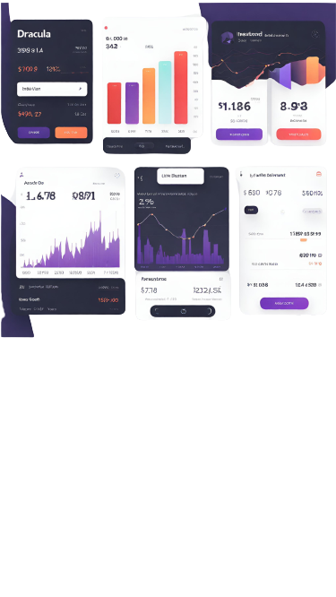

<div align="center">


</div>

<!-- PROJECT LOGO -->
<br />
<div align="center">
  <a href="https://github.com/tornotron">
    
  </a>
  <h3 align="center">Echno Attendance</h3>
  <div align="center">
    Attendance Management App  
    <br />
    <a href="https://github.com/tornotron/Investment-Automation-App/docs/README.md"><strong>Explore the docs »</strong></a>
    <br />
    <br />
    <a href="https://github.com/tornotron/Investment-Automation-App/demo/README.md">View Demo</a>
    ·
    <a href="https://github.com/tornotron/Investment-Automation-App/issues">Report Bug</a>
    ·
    <a href="https://github.com/tornotron/Investment-Automation-App/issues">Request Feature</a>
  </div>
</div>

<!-- TABLE OF CONTENTS -->
<details open>
  <summary>Table of Contents</summary>
  <ol>
    <li>
      <a href="#about-the-project">About The Project</a>
      <ul>
        <li><a href="#built-with">Built With</a></li>
      </ul>
    </li>
    <li>
      <a href="#getting-started">Getting Started</a>
      <ul>
        <li><a href="#prerequisites">Prerequisites</a></li>
        <li><a href="#installation">Installation</a></li>
      </ul>
    </li>
    <li><a href="#usage">Usage</a></li>
    <li><a href="#contributing">Contributing</a></li>
    <li><a href="#license">License</a></li>
    <li><a href="#contact">Contact</a></li>
    <li><a href="#acknowledgments">Acknowledgments</a></li>
  </ol>
</details>

<!-- ABOUT THE PROJECT -->
## About The Project

<div align="center">
  
 
  <!-- Add vertical space -->
  <br>  
  <br>  
  <br>  

</div>

* This is a Flutter application project aimed at managing attendance for various purposes.
* The app provides features to track attendance records, generate reports, and streamline attendance management processes.
* It is designed to be user-friendly and customizable according to specific requirements.

## Major Features Include:

- **User Authentication**: The app supports user authentication to ensure secure access to data.
- **Portfolio Management**: The app can maintain a portfolio on behalf of the user by interfacing with different stock brokers
- **Automated Optimization**: Automated optimization of portfolio for better returns
- **Multiple Algorithms**: Implementation of multiple trading algorithms for the user to select from

<p align="right">(<a href="#readme-top">back to top</a>)</p>

### Built With

<!-- Using Devicon font -->
<!--  -->  
<!-- * [![Flutter][Flutter-Icon]][https://flutter.dev] -->

<!-- Using skill-icons -->
<p align="center">
  <a href="https://skillicons.dev">
    
  </a>
</p>

<p align="right">(<a href="#readme-top">back to top</a>)</p>

<!-- Using Shields.io and Simple Icons -->
<!--    -->


<!-- GETTING STARTED -->
## Getting Started

The App can be deployed with Python production environment.

### Prerequisites

This is an example of how to list things you need to use the software and how to install them.

* Setup local dev environment with necessary libraries
* Setup either `anaconda` or `python virtual env`

### Installation

1. Install fastapi and uvicorn before running the project
```bash
  pip install fastapi
  pip install uvicorn
```

2. To start the server run the command below , it will run at endpoint http://localhost:8000/
```bash
uvicorn main:app --reload
```

<p align="right">(<a href="#readme-top">back to top</a>)</p>


<!-- USAGE EXAMPLES -->
## Usage

* The docker files for production will be made available soon

<p align="right">(<a href="#readme-top">back to top</a>)</p>

<!-- CONTRIBUTING -->
## Contributing

Contributions are what make the open source community such an amazing place to learn, inspire, and create. Any contributions you make are **greatly appreciated**.

If you have a suggestion that would make this better, please fork the repo and create a pull request. You can also simply open an issue with the tag "enhancement".
Don't forget to give the project a star! Thanks again!

1. Fork the Project
2. Create your Feature Branch (`git checkout -b feature/AmazingFeature`)
3. Commit your Changes (`git commit -m 'Add some AmazingFeature'`)
4. Push to the Branch (`git push origin feature/AmazingFeature`)
5. Open a Pull Request

<p align="right">(<a href="#readme-top">back to top</a>)</p>


<!-- LICENSE -->
## License

Distributed under the GNU License. See `LICENSE.txt` for more information.

<p align="right">(<a href="#readme-top">back to top</a>)</p>


<!-- CONTACT -->
## Contact

Tornotron - [@tornotron](https://twitter.com/tornotron) - info@tornotron.com 

Project Link: [https://github.com/tornotron/Investment-Automation-App](https://github.com/tornotron/Investment-Automation-App)

<p align="right">(<a href="#readme-top">back to top</a>)</p>

## Branch Ownership

 | Status | Branch | Owner
 | --- | --- | ---
 |  | `development` | [Abhijith Anandakrishnan](abhijithananthan@gmail.com)
 |  | `stock-branch` | [Hrishikesh Ajith](hrishikeshajith0@gmail.com)


<!-- ACKNOWLEDGMENTS -->
## Acknowledgments

* Tornotron E Commerce Private Ltd. - [https://tornotron.com](https://tornotron.com)

<p align="right">(<a href="#readme-top">back to top</a>)</p>

